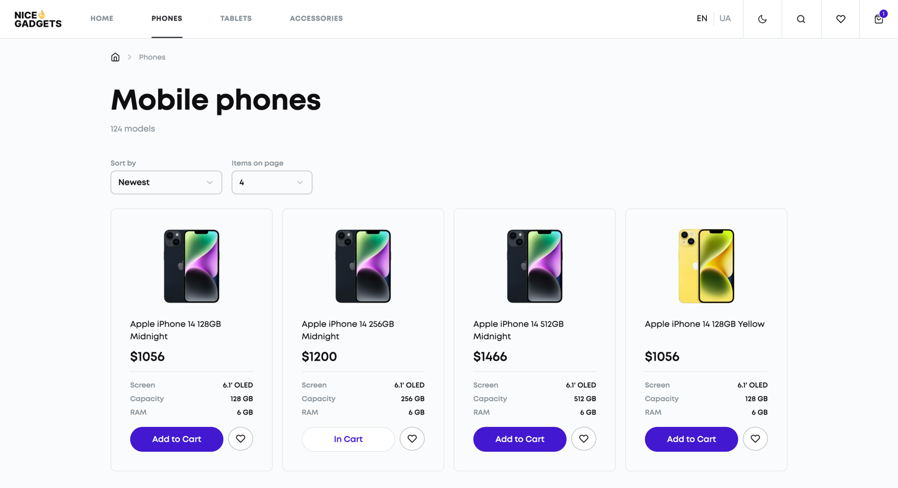

# Nice Gadgets store

## Description
A responsive web application showcasing a diverse catalog of phones, tablets, and accessories. Built with React + TypeScript and Vite, it offers an intuitive user experience with dynamic data handling, user-friendly navigation, and modern UI/UX practices. The store supports both Ukrainian and English languages, and features dark and light themes. It uses Skeletons for seamless loading, integrates the Swiper library for a smooth product carousel, and allows users to search, filter, and sort products. Additionally, customers can easily find specific items, add them to their favorites or cart, and enjoy a personalized shopping experience.

## Technologies used
* HTML5
* CSS3
* SCSS
* SASS
* React
* TypeScript
* Rest API
* Git
* Vite
* React-i18next (for internationalization)
* Swiper React (for the product carousel)
* React Loading Skeleton (for loading animations)

## Instructions for Working with the Project

	1. Open your terminal and run the following command to clone the repository:

        git clone https://github.com/modeltoIT/nice-gadgets-store.git

	2. Move into the project directory:
    
        cd nice-gadgets-store

	3. Ensure that Node.js version v20.x.x is installed. Verify this by running:
        
        node -v
        
        If the version is incorrect, install or update Node.js from Node.js official website.

	4. Install the necessary project dependencies by running:
        
        npm install

	5. Start the development server with the command:

        npm start

## View Project

* Live Demo: [View the Project](https://modeltoit.github.io/nice-gadgets-store/)
* Figma Design: [Nice Gadgets store](https://www.figma.com/design/xMK2Dy0mfBbJJSNctmOuLW/Phone-catalog-(V2)-Rounded-Style-1)

## Preview

